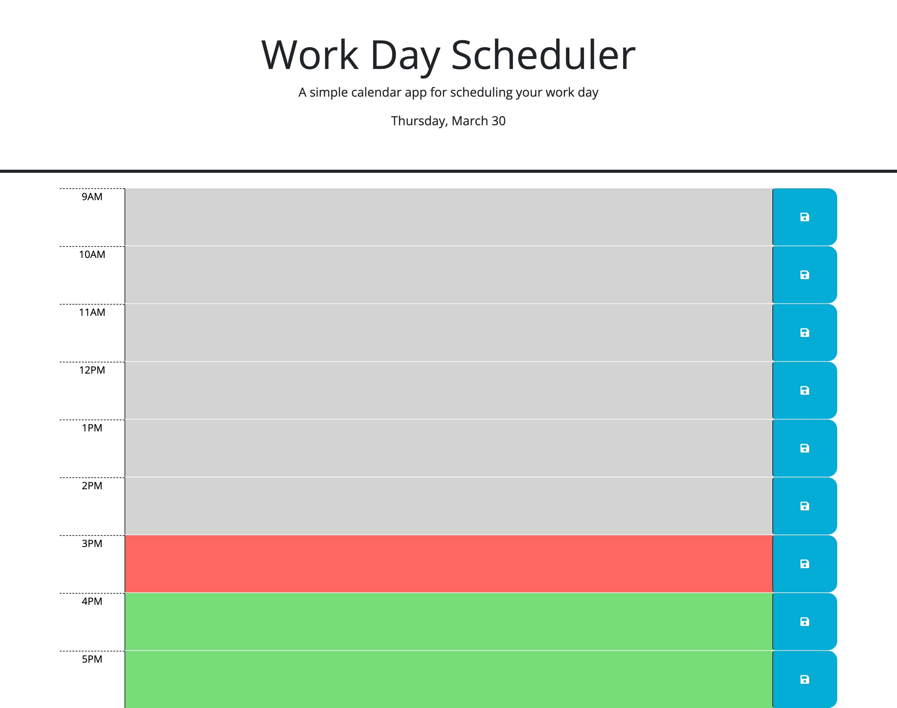
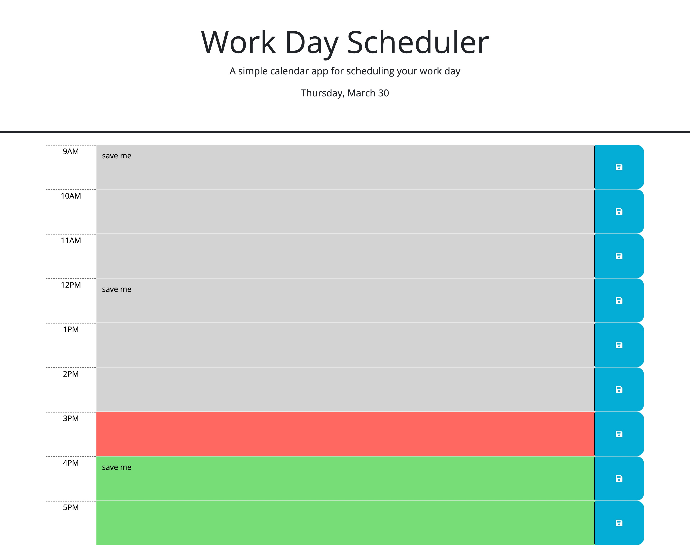

# mark-it-down-calendar

## Description
* Here I have created a work day schdeuling application, that allows the user to create a sort of to-do list for their work day. The calendar has time blocks that are assigned colors based on whether the time stamp is in the past, present or future. The application allows the user to save their notes, so if the window is refreshed, they will still be there for them to refer back to.

* This project helped me brush up on my localStorage skills, and figure out how to place these methods in my code. I also learned that you can use both the id and class when getting an element in JQuery. It was also fun applying what we learned about dayjs into an actual assignment.

* This application is definitely useful for days when you have too much going on to remember it all off the top of your head. I want add these dynamically through JS/JQuery.

## Issues to be solved
* This page needs to contain timeblocks for the stereotypical 9AM-5PM work hours that are responsive to the current time of day.

* I need to add the current date to the header using dayjs.

* There needs to be an event listener on the different save buttons that will send the text areas value to the local storage.

* The text values must stay on the page if the window is refreshed.

## How the issues were solved
* First I added the dayjs library, and set the current time and current date. Formatting the date with the .format() method.

* I started a for loop that would add the elements that make up the container where the user will input and save their notes, as well as see if their notes are past, present, or new based on color. I then append the newly created elements to the container div that already exists in the HTML. I accomplished the color aspect using if statements that checked if the time blocks were less than, equal to, or greater than the current time variable, which would then add the corresponding classes.

* I created a click listener on the save buttons that would save the note, of the previous sibling element, to the local storage by using the this and .prev methods.

* To keep the text values on the page, I used the getItem method along with an if statement that checked that the text area value was not null. If the value was not null it would display the store text value in the correct text area on the browser. I went the long route and created duplicate statements for all text areas, because I wasnt confident in my method of iterating through the id's. I really look forward to coming back to this project with a better understanding and refactoring the code.

## Assistance 
* I used the w3schools article about the .prev() method to help figure out how to get the content from the previous element, being the textarea.

* I found a post on stackoverflow about appending elements that helped me figure out why my elements were being diplsayed in the wrong position on the page. I guess order really does matter!

* I read through a geeksforgeeks article about how to use this in jquery, because I needed a refresher on what exactly it was going to refer to.

* I found a post on stackoverflow that helped me understand using a loop to create a certain amount of elements.

* I also used the askBCS feature in slack to help with some issues with local storage.

